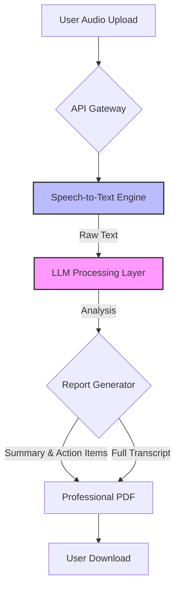

# AI Meeting Assistant 🎙️🤖

>An intelligent meeting productivity tool that transforms raw audio into structured, actionable insights. This project uses state-of-the-art LLMs and Speech-to-Text models to generate full transcripts, summaries, and action items in a professional PDF format.

## Live Demo
🚀 [Try it here](https://huggingface.co/spaces/dev-mzeeshan/ai-meeting-assistant)

## 🚀 Key Features
- **High-Fidelity Transcription:** Converts meeting audio to text with high accuracy.

- **LLM-Powered Analysis:** Automatically extracts key discussion points, summaries, and urgent action items.

- **Complete PDF Export:** Generates professional, branded reports including the full transcript (no character limits) using ReportLab.

- **Asynchronous Processing:** Built for speed and efficiency using modern Python frameworks.

## 🏗️ System Architecture



## 🛠️ Tech Stack
- **Language:** Python 3.12+
- **LLM:** Llama 3.3 (via Groq Cloud)
- **Transcription:** OpenAI Whisper
- **PDF Generation** ReportLab
- **Frontend:** Gradio (Web UI) 

## Run Locally
```bash
#Clone the repository:
git clone [https://github.com/YOUR_USERNAME/ai-meeting-assistant.git](https://github.com/YOUR_USERNAME/ai-meeting-assistant.git)
cd ai-meeting-assistant

# Set up Virtual Environment:
python -m venv venv
source venv/bin/activate  # On Windows: venv\Scripts\activate

# Install Dependencies:
pip install -r requirements.txt

# Environment Variables:
# Create a .env file and add your API keys:
OPENAI_API_KEY=your_key_here

# Run the Application:
python app.py
```

## 📊 Roadmap
- [x] Full Transcript PDF Export

- [ ] Multi-Speaker Diarization (Identification of who is speaking)

- [ ] Multi-language support

- [ ] Integration with Google Calendar/Zoom


## Author
**Muhammad Zeeshan** 
AI Engineer  
[Portfolio](https://zeeshan-portfolio-amber.vercel.app) · 
[LinkedIn](https://linkedin.com/in/zeeshanofficial)